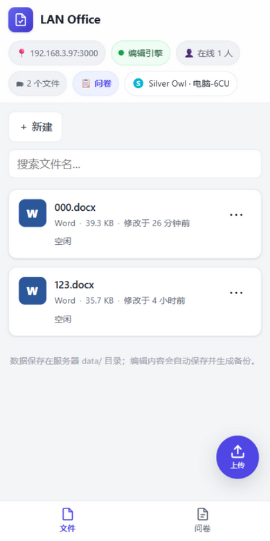

<div align="center">

# 🏠 LAN Office

**局域网里的多人协同 Office 编辑器 —— 电脑双击即用，同一 WiFi 下的手机、平板、电脑一起写文档**

真实编辑 `.docx` `.xlsx` `.pptx` · 实时多人协同 · 修订署名 · 课堂问卷 · 自动备份 · 无需公网 · 免费开源

[](https://github.com/Andy-scy/LAN-Office/releases)
[](LICENSE)
[](https://nodejs.org)
[](#安装)
[](https://github.com/ONLYOFFICE/DocumentServer)

[快速开始](#-快速开始) · [界面预览](#-界面预览) · [功能总览](#-功能总览) · [常见问题](#-常见问题) · [开源调研](docs/research.md)


*电脑版文件列表 —— 每个文件卡片都能看到类型、大小、修改时间，以及"谁正在编辑"*

</div>

---

## ✨ 它能做什么

| | 功能 | 一句话说明 |
|---|---|---|
| 📝 | **真实 Office 编辑** | 浏览器里直接编辑 Word / Excel / PowerPoint，格式保真，不是转 HTML 的假编辑器 |
| 👥 | **多人实时协同** | 同一 WiFi 下大家打开同一文件即进入同一会话，改动能实时看见 |
| 🖊 | **修订模式** | 谁写的哪一段按**作者颜色 + 名字**标注，老师可逐条"同意/否决" |
| 📋 | **课堂问卷** | 几分钟出一套选择题，学生扫码即答，柱状统计 + 明细 + 导出 CSV |
| 💾 | **自动保存 + 备份** | 停手几秒自动落盘；每次保存前自动留档，改错了随时回退 |
| 📱 | **三套自适应 UI** | 电脑 / 平板 / 手机自动识别，各自定制交互（触屏大按钮、底部导航、悬浮上传球） |
| 🏷 | **设备名称** | 每台设备可命名（电脑-6CU、手机-A1），在线列表与答卷明细里分得清清楚楚 |
| 👥 | **分组与权限** | 教师密码解锁管理面板；学生凭 4 位加入码入组，只能编辑本组与公共文档，他组文档隐藏或只读；上传/新建/删除/重命名仅教师可操作 |
| 🔌 | **局域网即用** | 无需公网、无需账号，数据全部留在自己电脑上 |

<div align="center">


*修订模式 —— 红色下划线的"123048"是协作者刚插入的内容，按作者署名标色，可逐条"同意/否决"*

</div>

## 📸 界面预览

**手机版**（触屏大按钮 · 悬浮上传球 · 底部导航）　　**课堂问卷统计**（实时柱状图 · 明细 · 导出 CSV）

|  |  |
|:---:|:---:|

## 🚀 快速开始

### 第一次使用（一次性准备）

1. 双击 **`setup.bat`** —— 自动安装绿色版 Node.js（含 SHA256 校验）、项目依赖，并引导安装 ONLYOFFICE Docs 社区版（编辑引擎，约 1GB 官方安装器）
2. 安装 OnlyOffice 时在弹出的安装界面里：同意协议 → Install → UAC 点"是" → Finish
3. 完成！新手请看 [使用说明.txt](使用说明.txt)，每一步都有保姆级说明

### 以后每天

1. 服务器电脑双击 **`start.bat`**，黑窗口会显示：

```
本机访问:    http://localhost:3000
局域网访问:  http://192.168.3.97:3000   ← 其他设备用这个
```

2. 同一 WiFi 下的设备用浏览器打开"局域网访问"地址 → 上传或新建文档 → 开写！

> 💡 首次启动若弹出 Windows 防火墙提示，勾选"专用网络"并点"允许访问"。

## 🧭 使用文档

**推荐阅读：[使用说明.txt](使用说明.txt)** —— 面向小白的手把手手册，每个功能都写了"怎么用"和"怎么用好"：

- 文件管理：上传的 3 种方式、下载、重命名、删除与后悔药、备份历史恢复
- 多人协同：怎么进入同一会话、自动保存的时机、修订模式怎么开
- 问卷：出卷 → 答题 → 看统计 → 导出 CSV 全流程
- 手机 / 平板三套界面的操作差异、设备名称的用法

## 🔍 开源项目调研

完整调研报告见 [docs/research.md](docs/research.md)。核心结论：**ONLYOFFICE Document Server（AGPL-3.0）** 是唯一同时满足"三件套真实编辑 + 内置实时协同 + Windows 原生安装 + 免费不限人数"的开源引擎，故采用「复用 OnlyOffice 引擎 + 自研轻量 Node.js 服务层」架构：

- ✅ **复用**：文档编辑、格式解析、实时协同合并（引擎内置 OT 机制）
- ✅ **自研**：文件管理（UUID 索引防路径穿越）、在线状态、自动保存管线（下载 → 校验 → 备份 → 原子替换）、局域网引导（网卡探测 / 端口自增 / 防火墙提示 / JWT 密钥自动读取）
- ❌ **明确不做**：假 HTML 转换编辑器、自研 OT/CRDT 重复造轮子

集成方式参考官方 [document-server-integration](https://github.com/ONLYOFFICE/document-server-integration)（Apache-2.0）并做了安全强化。

## ❓ 常见问题

**Q：分组和教师密码怎么用？**
开启"管理面板"（首页点 👩‍🏫 教师图标，默认密码 `1234`，见启动横幅；可在 `config/config.json` 的 `teacherPassword` 修改）→ 创建分组并把 4 位加入码投在黑板上 → 学生打开网站输入加入码入组 → 在"文件归组"里把文档分给各组。其他组文档可设为"完全隐藏"或"只读"。开启后：上传/新建/删除/重命名/问卷创建仅教师可操作。

**Q：能打开文件列表，但显示"编辑引擎未连接"？**
服务器上未安装或未启动 ONLYOFFICE Docs。重跑 `setup.bat`，或按"快速开始"手动安装。

**Q：编辑器报 Token / JWT 错误？**
OnlyOffice 7.2+ 默认启用 JWT。LAN Office 会自动读取 `C:\Program Files\ONLYOFFICE\DocumentServer\config\local.json` 的密钥；若读取失败，把其中 `services.CoAuthoring.secret.inbox.string` 的值填入 `config/config.json` 的 `ds.jwtSecret` 后重启。

**Q：其他设备打不开网址？**
确认连的是同一个 WiFi；首次运行在防火墙提示里点"允许"；或管理员运行
`netsh advfirewall firewall add rule name="LAN Office" dir=in action=allow protocol=TCP localport=3000`。

**Q：网址端口不是 3000？**
被占用会自动换 3001、3002……以启动横幅显示的为准。

**Q：setup.bat 下载 OnlyOffice 失败或很慢？**
安装器约 1GB 走 GitHub 发布渠道，向导已内置断点续传与 TLS 兼容修复（`--ssl-no-revoke`，解决 `CRYPT_E_REVOCATION_OFFLINE`），重跑会接着下。也可手动从 [Releases](https://github.com/ONLYOFFICE/DocumentServer/releases/latest) 下载 `onlyoffice-documentserver.exe` 放进项目根目录，向导会直接使用。

**Q：80 端口被别的程序占用（如 Steam++ 加速器）？**
OnlyOffice 默认用 80 端口。安装前先退出占用程序；安装后可修改其 nginx 配置换端口，并在 `config/config.json` 的 `ds.url` 里指定。

**Q：文件存在哪？想整体备份？**
都在项目目录的 `data\` 里。整体备份 = 复制整个 `data\` 文件夹。

## ⚠️ 已知限制

- 在线编辑必须安装 ONLYOFFICE Docs 社区版（界面带 OnlyOffice 品牌；免费、不限人数，建议服务器 4GB 内存）
- `.pdf` 仅支持查看；Excel 与 PPT 无修订归属机制（格式限制），仍保留彩色光标
- 无账号系统（面向局域网信任环境）；Document Server 崩溃时未保存的会话内容会丢失
- 极端并发下保存瞬间加入的编辑者可能拆分为两个会话（官方集成模式的已知边界，后保存者覆盖）

## 📄 开源协议

- 本项目自身代码以 **MIT** 协议发布（见 [LICENSE](LICENSE)）
- [ONLYOFFICE Document Server](https://github.com/ONLYOFFICE/DocumentServer) 由 ONLYOFFICE 开发，**AGPL-3.0**，不随本项目分发、由用户独立安装，经进程间 HTTP API 集成
- npm 依赖清单见 [LICENSES-THIRD-PARTY.md](LICENSES-THIRD-PARTY.md)

## 🗺 后续计划

- [ ] 可选访问口令（房间密码）
- [ ] 文件回收站（删除可撤销）
- [ ] 问卷支持多选题与匿名模式
- [ ] HTTPS 局域网访问
- [ ] 打包免装 Node 的绿色发行版

---

<div align="center">

**LAN Office** · 把局域网变成一间可以共同书写的教室 🏫

<sub>如果对你有帮助，欢迎点个 Star ⭐</sub>

</div>
